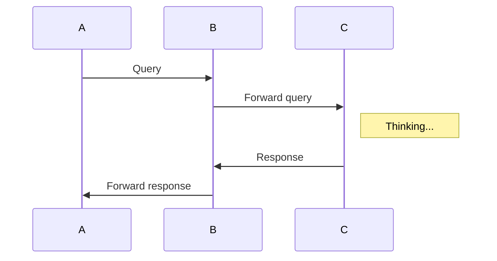
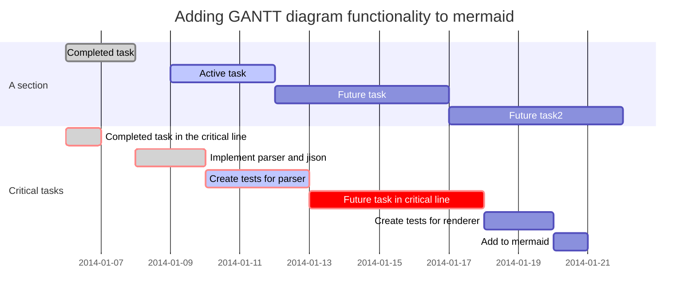

# MarkdownGrammar
------------------

[toc]

# 哈哈哈

## MarkdownGrammar

### MarkdownGrammar1

### MarkdownGrammar2

## MarkdownGrammar

### MarkdownGrammar1

### MarkdownGrammar2


Markdown 语法
==============

## 1. 井号 `#` 代表标题级数
# 一级标题
## 二级标题
一次往下即 `1` 到 `6` 个 `#`,对应标题 `1` 到 `6`阶。

### 2. 分割线的语法只需要另起一行，连续输入三个星号***或___即可
_____________

--------------

***

#### 3. 使标题加粗(这是一个一级标题)
=============================

使标题加粗(这是一个二级标题)
---------------------------

4. 显示链接中带括号的图片
![][1]
[1]: http://latex.codecogs.com/gif.latex?\prod%20\(n_{i}\)+1

5. 输入的URL或邮箱自动创建链接，用<>。
<http://baidu.com>

<2281075105@qq.com>

6. 小型文本
<small>Markdown 语法</small>

7. 缩进
&emsp;&emsp;全角空格

8. 删除线 
~~Markdown 语法~~

9. Markdown 语法 [[^1]]()

   Markdown 语法 [[20]]()

10. [[^1]]() 行内式超链接：[MarkdownGrammar](https://github.com/lb2281075105/MarkdownGrammar.git)

    []里写链接文字，()里写链接地址, ()中的”“中可以为链接指定title属性，title属性可加可不加。title属性的效果是鼠标悬停在链接上会出现指定的 title文字。[链接文字](链接地址 “链接标题”)’这样的形式。链接地址与链接标题前有一个空格。

    

    ![美丽花儿][flower]
    [flower]:http://ww2.sinaimg.cn/large/56d258bdjw1eugeubg8ujj21kw16odn6.jpg  "美丽花儿"

    欢迎来到[MarkdownGrammar](https://github.com/lb2281075105/MarkdownGrammar.git "MarkdownGrammar")

    [[^2]]() 参考式超链接：写法 [链接文字][链接标记] 在文本的任意位置添加[链接标记]:链接地址 “链接标题”，链接地址与链接标题前有一个空格。如果链接文字本身可以做为链接标记，你也可以写成[链接文字][] 
        [链接文字]：链接地址的形式，见代码的最后一行。

    我经常访问的几个网站[Google][1]、[Leanote][2]以及[自己的博客][3]
        [Leanote 笔记][2]是一个不错的[网站][]。

[1]:http://www.google.com "Google"
[2]:http://www.leanote.com "Leanote"
[3]:http://http://blog.leanote.com/freewalk "梵居闹市"
[网站]:http://baidu.com "百度"

    [[^3]]() 自动链接：自动链接形式来处理网址和电子邮件信箱 <http://baidu.com><2281075105@qq.com>

11. *字体斜体* 或 _斜体_
    **字体加粗**
    ***字体加粗并变斜***

12. 图片添加链接
[](https://travis-ci.org/iphone5solo/PYSearch)

[](https://github.com/lb2281075105/MarkdownGrammar.git)


13. 跳转到标题对应的内容
   [[^1]]() [Markdown 语法](#Markdown)里面不能有空格
             <a name="Markdown"></a>
            # Markdown

   [[^2]]() [Markdown 语法](#Markdown)里面不能有空格
            #<a id="Markdown"></a>Markdown

   [[^3]]() ## 0. 目录{#index}
            跳转到[目录](#index)
14. 

    MJRefresh Markdown语法错误

15. 关于 Markdown ([Markdown 语法], [Markdown 语法], [Markdown 语法])

16. `*` 、`+`、 `-` 无序
    + Markdown 语法
      + Markdown 语法
        - Markdown 语法
          * Markdown 语法
    1. 有序(有序列表则使用数字接着一个英文句点。应该顶格写)
    2. 有序
    3. 有序
    
    1. 首先fork我的项目
    2. 把fork过去的项目也就是你的项目clone到你的本地
    3. 在命令行运行 `git branch develop` 来创建一个新分支
    4. 运行 `git checkout develop` 来切换到新分支
    5. 运行 `git remote add upstream https://github.com/numbbbbb/the-swift-programming-language-in-chinese.git` 把我的库添加为远端库
    6. 运行 `git remote update`更新
    7. 运行 `git fetch upstream gh-pages` 拉取我的库的更新到本地
    8. 运行 `git rebase upstream/gh-pages` 将我的更新合并到你的分支

    这是一个初始化流程，只需要做一遍就行，之后请一直在develop分支进行修改。

    如果修改过程中我的库有了更新，请重复6、7、8步。

    修改之后，首先push到你的库，然后登录GitHub，在你的库的首页可以看到一个 `pull 

    request` 按钮，点击它，填写一些说明信息，然后提交即可。


    定义型列表：

17. [Markdown 语法][]
    
    [Markdown 语法]:https://github.com/lb2281075105/MarkdownGrammar.git

18. 对号：
    - [x] Markdown 语法
    另一种样式：
    - [ ] Markdown 语法

19. 表格：管道符|

序号        |       类库     |     简介     |
:--------- |:-------------:|:-------------|
1          | 济南仓         |     大明湖    | 
2          | 菏泽仓         |     牡丹花    |


序号        |       中学生   |     成绩     |
:---------:|:-------------:|:-----------:|
1          | 李四           |     98分    | 
2          | 张三           |     100分   |


序号        |       小学生   |     成绩    |
----------:|:-------------:|------------:|
1          | 小明           |     89分    | 
2          | 小亮           |     100分   |

20. 脚注

    使用[^n]占位符号可以将脚注[^1]添加到文本[^2]中。

21. 换行符 : 一行结束时输入两个空格
   
22. 使用[1]标记

    [1]: 第一个上标解释 ↩

23. 往里缩进指定的空格：就会出现浅灰色背景。(3 个空格、多个tab键 或 制表符)

         往里缩进指定的空格：就会出现浅灰色背景。往里缩进指定的空格：就会出现浅灰色背景。往里缩进指定的空格：就会出现浅灰色背景。往里缩进指定的空格：就会出现浅灰色背景。往里缩进指定的空格：就会出现浅灰色背景。往里缩进指定的空格：就会出现浅灰色背景。往里缩进指定的空格：就会出现浅灰色背景。

24. 内容目录
   在段落中填写 [TOC] 以显示全文内容的目录结构。

25. @(示例笔记本)[马克飞象|帮助|Markdown]
    **马克飞象**是一款专为印象笔记（Evernote）打造的Markdown编辑器，通过精心的设计与技术实现，配合印象笔记强大的存储和同步功能，带来前所未有的书写体验。

26. 正如您在阅读的这份文档，它使用简单的符号标识不同的标题，将某些文字标记为**粗体**或者*斜体*，创建一个[链接](http://www.example.com)或一个脚注[^demo]。下面列举了几个高级功能，更多语法请按`Ctrl + /`查看帮助。 

    [^demo]: 这是一个示例脚注。请查阅 [MultiMarkdown 文档]

27. 使用 `- [ ]` 和 `- [x]` 语法可以创建复选框，实现 todo-list 等功能。

28. 
    ---

    title: 更新内容
    tags: 更新说明,小书匠

    ---

29. 
## 视频
```markdown
%[名称](链接地址)
%[名称][1]
[1] : 链接地址
```
## 音频
```markdown
~[名称](链接地址)
~[名称][1]
[1] : 链接地址
```
## 附件
```markdown
=[名称](链接地址)
=[名称][1]
[1] : 链接地址
```


# 示例

[toc]


http://www.github.com/suziwen/markdownxiaoshujiang
http://www.xiaoshujiang.com

# 这是 H1 一s级标题
## 这是 H2 二级标题
### 这是 H3 三级标题
#### 这是 H4 四级标题
##### 这是 H5 五级标题
###### 这是 H6 六级标题

### 视频
%[电影](http://markdown.xiaoshujiang.com/media/movie.ogg)

### 音频
~[音乐](http://markdown.xiaoshujiang.com/media/horse.ogg)

### 附件
=[附件](./jianzhu.jpg)

### 待办事项
-[ ] 未完成事项
-[x] 完成事项
-[X] 完成事项

### 缩写定义

The HTML specification
is maintained by the W3C.

*[HTML]: Hyper Text Markup Language
*[W3C]:  World Wide Web Consortium

### 印刷字替换

(c) (C) (r) (R) (tm) (TM) (p) (P) +-

### html代码

<div>html代码</div>

### 流程图 ([语法](http://adrai.github.io/flowchart.js/))

```flow
st=>start: 开始
e=>end: 结束
op=>operation: 操作步骤
cond=>condition: 是 或者 否?

st->op->cond
cond(yes)->e
cond(no)->op
```

### 序列图 ([语法](https://github.com/bramp/js-sequence-diagrams/blob/master/src/grammar.jison))

```sequence
小明->小李: 你好 小李, 最近怎么样?
Note right of 小李: 小李想了想
小李-->小明: 还是老样子
```

### 脚注[^1x]

[^1x]: 脚注的用法

### 表格Tables

First Header  | Second Header
------------- | -------------
Content Cell  | Content Cell
Content Cell  | Content Cell

### 定义

苹果
: 一种水果
: 一种品牌，计算机，手持设备

桔子
: 一种水果

### 文字格式

**这是文字粗体格式**

__这是文字粗体格式__

*这是文字斜体格式*

_这是文字斜体格式_

~~在文字上添加删除线~~

++插入的文字++

==被记号的文字==

上角文字: 19^th^

下角文字: H~2~O

### 无序列表

* 项目1
* 子项目1.1
* 子项目1.2
* 子项目1.2.1
* 项目2
* 项目3

### 有序列表

1. 项目1
2. 项目2
3. 项目3
1. 项目3.1
2. 项目3.2

### 有序列表起始编号

58. 项目5
2. 项目6

### 图片


链接

[链接名称](http://xiaoshujiang.com)
### 引用

> 第一行引用文字
> 第二行引用文字
### 水平线

***
### 代码

#### 行内代码

`var x = "hello world"`

#### 块代码

```java
/**
* @author John Smith <john.smith@example.com>
* @version 1.0
*/
package l2f.gameserver.model;

import >>++java.util.ArrayList++<<;

>>~~public abstract class L2Character {~~<<
>>++public abstract class L2Character extends L2Object {++<<
public static final Short ABNORMAL_EFFECT_BLEEDING = 0x0_0_0_1; // not sure

public void moveTo(int x, int y, int z) {
_ai = null;
_log.warning("Should not be called");
if (1 > 5) {
return;
}
}

/** Task of AI notification */
@SuppressWarnings( { "nls", "unqualified-field-access", "boxing" })
>>==public class NotifyAITask implements Runnable {
private final CtrlEvent _evt;

List<String> mList==<< = new ArrayList<String>()

public void run() {
try {
getAI().notifyEvent(_evt, _evt.class, null);
} catch (Throwable t) {
t.printStackTrace();
}
}
}
}
```
## 块代码内文字格式
### 块代码高亮标记
```javascript
var >>==hello==<< = 'hello world'
```
### 块代码删除线
```javascript
var >>~~hello~~<< = 'hello world'
```
### 块代码加粗
```javascript
var >>**hello**<< = 'hello world'
```
### 块代码下横线
```javascript
var >>++hello++<< = 'hello world'
```

### 显示行号
``` javascript?linenums
var x = 1;
var z = 'str';
```

### 高亮指定行
``` javascript?linenums&fancy=1,3,5
var x = 1;
var y = 2;
var z = 3;
var u = 4;
var w = 5;
var a = 6;
```

### 显示行号并从指定行数计数
``` javascript?linenums=10
var x = 1;
```

### 禁用显示行号
``` javascript?linenums=false
var x = 1;
```

### 公式
#### 行内公式
这是行内公式`!$ \Gamma(z) = \int_0^\infty t^{z-1}e^{-t}dt\,. $`
#### 块公式
```mathjax!
$$\Gamma(z) = \int_0^\infty t^{z-1}e^{-t}dt\,.$$
```

#### 带编号的公式
`!$\eqref{ref1}$`

```mathjax!
\begin{equation}
\int_0^\infty \frac{x^22}{e^x-1}\,dx = \frac{\pi^4}{15}\label{ref1}
\end{equation}
```

`!$\eqref{ref1}$`
### 统计图
```plot!
{
"data": [ [[0, 0], [1, 1]] ],
"options": { "yaxis": { "max": 1 } }
}
```

### mermaid流程图，序列图，甘特图


#### 流程图


#### 序列图



#### 甘特图


### PPT语法

使用
```

----

```
作为一个水平页分割线，注意在`----`前后都需要空一行

使用
```

--

```
作为一个垂直页分割线, 注意在`--`前后都需要空一行

通过如下形式
```
<!-- .element: class="fragment" data-fragment-index="1" -->
```
可以实现fragment显示效果

注：　在演示文档模式下，`toc`和脚注语法将失效.


### emoji表情[语法](https://github.com/twitter/twemoji)

> Classic markup: :wink: :crush: :cry: :tear: :laughing: :yum:
>
> Shortcuts (emoticons): :-) :-( 8-) ;)

### 自定义class

#### 自定义class用例{green}

你可以通过查看生成的html代码里，在h4里找到名为`green`的class名称．

### cjk强调

#### _这里将显示中文衬线字体做为强调样式_

### cjk注音标示

{小}(xiao){书}(shu){匠}(jiang)

### 居中显示

->居中显示的{文字}(wenzi)<-

-><-

### 文字对齐

:>居左显示的文字<-

->居右显示的文字<:

:>两端对齐显示的文字<:

->居中显示的文字<-

### 增强型表格
|First Header  | Second Header ||
|First Header  | Second Header | Third Header|
|------------- | -------------|-------------|
表身1Content Cell  | Merge Content Cell||
Content Cell  | Content Cell| Content Cell|

表身2Content Cell  | Merge Content Cell||
Content Cell  | Content Cell| Content Cell|
[表格标题]
