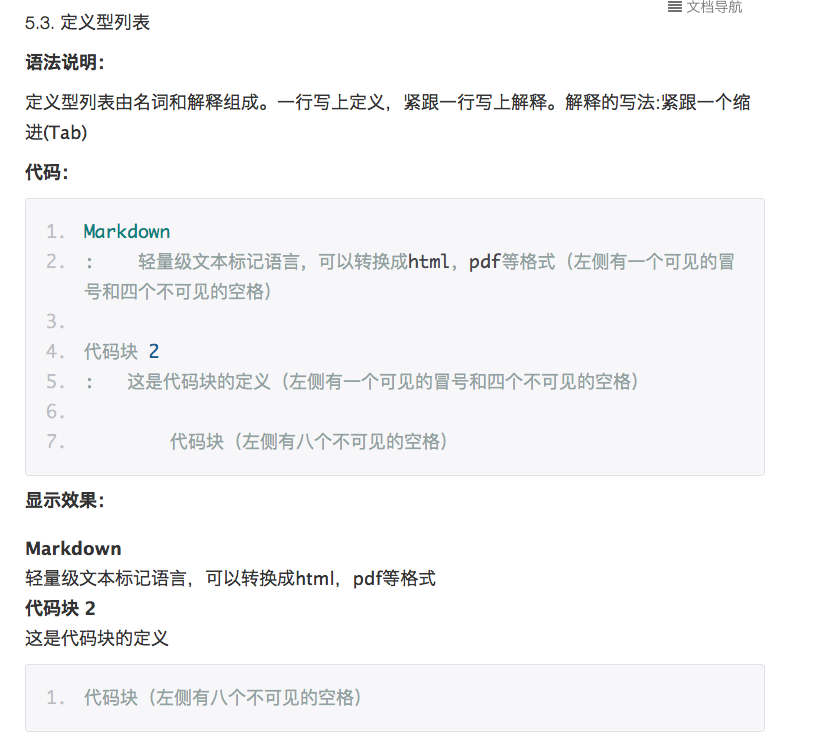

# MarkdownGrammar

[TOC]

Markdown 语法
==============

### 1. 井号 `#` 代表标题级数
# 一级标题
## 二级标题
一次往下即 `1` 到 `6` 个 `#`,对应标题 `1` 到 `6`阶。

### 2. 分割线的语法只需要另起一行，连续输入三个星号***或___即可
_____________

--------------

***

3. 使标题加粗(这是一个一级标题)
=============================

使标题加粗(这是一个二级标题)
---------------------------

4. 显示链接中带括号的图片
![][1]
[1]: http://latex.codecogs.com/gif.latex?\prod%20\(n_{i}\)+1

5. 输入的URL或邮箱自动创建链接，用<>。
<http://baidu.com>

<2281075105@qq.com>

6. 小型文本
<small>Markdown 语法</small>

7. 缩进
&emsp;&emsp;全角空格

8. 删除线 
~~Markdown 语法~~

9. Markdown 语法 [[^1]]()

   Markdown 语法 [[20]]()

10. [[^1]]() 行内式超链接：[MarkdownGrammar](https://github.com/lb2281075105/MarkdownGrammar.git)

    []里写链接文字，()里写链接地址, ()中的”“中可以为链接指定title属性，title属性可加可不加。title属性的效果是鼠标悬停在链接上会出现指定的 title文字。[链接文字](链接地址 “链接标题”)’这样的形式。链接地址与链接标题前有一个空格。

    

    ![美丽花儿][flower]
    [flower]:http://ww2.sinaimg.cn/large/56d258bdjw1eugeubg8ujj21kw16odn6.jpg  "美丽花儿"

    欢迎来到[MarkdownGrammar](https://github.com/lb2281075105/MarkdownGrammar.git "MarkdownGrammar")

    [[^2]]() 参考式超链接：写法 [链接文字][链接标记] 在文本的任意位置添加[链接标记]:链接地址 “链接标题”，链接地址与链接标题前有一个空格。如果链接文字本身可以做为链接标记，你也可以写成[链接文字][] 
        [链接文字]：链接地址的形式，见代码的最后一行。

    我经常访问的几个网站[Google][1]、[Leanote][2]以及[自己的博客][3]
        [Leanote 笔记][2]是一个不错的[网站][]。

[1]:http://www.google.com "Google"
[2]:http://www.leanote.com "Leanote"
[3]:http://http://blog.leanote.com/freewalk "梵居闹市"
[网站]:http://baidu.com "百度"

    [[^3]]() 自动链接：自动链接形式来处理网址和电子邮件信箱 <http://baidu.com><2281075105@qq.com>

11. *字体斜体* 或 _斜体_
    **字体加粗**
    ***字体加粗并变斜***

12. 图片添加链接

13. 跳转到标题对应的内容
   [[^1]]() [Markdown 语法](#Markdown)里面不能有空格
             
            # Markdown

   [[^2]]() [Markdown 语法](#Markdown)里面不能有空格
            #Markdown

   [[^3]]() ## 0. 目录{#index}
            跳转到[目录](#index)
14. 

    MJRefresh Markdown语法错误

15. 关于 Markdown ([Markdown 语法], [Markdown 语法], [Markdown 语法])

16. `*` 、`+`、 `-` 无序
    + Markdown 语法
      + Markdown 语法
        - Markdown 语法
          * Markdown 语法
    1. 有序(有序列表则使用数字接着一个英文句点。应该顶格写)
    2. 有序
    3. 有序
    
    1. 首先fork我的项目
    2. 把fork过去的项目也就是你的项目clone到你的本地
    3. 在命令行运行 `git branch develop` 来创建一个新分支
    4. 运行 `git checkout develop` 来切换到新分支
    5. 运行 `git remote add upstream https://github.com/numbbbbb/the-swift-programming-language-in-chinese.git` 把我的库添加为远端库
    6. 运行 `git remote update`更新
    7. 运行 `git fetch upstream gh-pages` 拉取我的库的更新到本地
    8. 运行 `git rebase upstream/gh-pages` 将我的更新合并到你的分支

    这是一个初始化流程，只需要做一遍就行，之后请一直在develop分支进行修改。

    如果修改过程中我的库有了更新，请重复6、7、8步。

    修改之后，首先push到你的库，然后登录GitHub，在你的库的首页可以看到一个 `pull 

    request` 按钮，点击它，填写一些说明信息，然后提交即可。

    定义型列表：

17. [Markdown 语法][]
    
    [Markdown 语法]:https://github.com/lb2281075105/MarkdownGrammar.git

18. 对号：
    - [x] Markdown 语法
    另一种样式：
    - [ ] Markdown 语法

19. 表格：管道符|

序号        |       类库     |     简介     |
:--------- |:-------------:|:-------------|
1          | 济南仓         |     大明湖    | 
2          | 菏泽仓         |     牡丹花    |

序号        |       中学生   |     成绩     |
:---------:|:-------------:|:-----------:|
1          | 李四           |     98分    | 
2          | 张三           |     100分   |

序号        |       小学生   |     成绩    |
----------:|:-------------:|------------:|
1          | 小明           |     89分    | 
2          | 小亮           |     100分   |

20. 脚注

    使用[^n]占位符号可以将脚注[^1]添加到文本[^2]中。

21. 换行符 : 一行结束时输入两个空格
   
22. 使用[1]标记

    [1]: 第一个上标解释 ↩

23. 往里缩进指定的空格：就会出现浅灰色背景。(3 个空格、多个tab键 或 制表符)

         往里缩进指定的空格：就会出现浅灰色背景。往里缩进指定的空格：就会出现浅灰色背景。往里缩进指定的空格：就会出现浅灰色背景。往里缩进指定的空格：就会出现浅灰色背景。往里缩进指定的空格：就会出现浅灰色背景。往里缩进指定的空格：就会出现浅灰色背景。往里缩进指定的空格：就会出现浅灰色背景。

24. 内容目录
   在段落中填写 [TOC] 以显示全文内容的目录结构。

25. @(示例笔记本)[马克飞象|帮助|Markdown]

