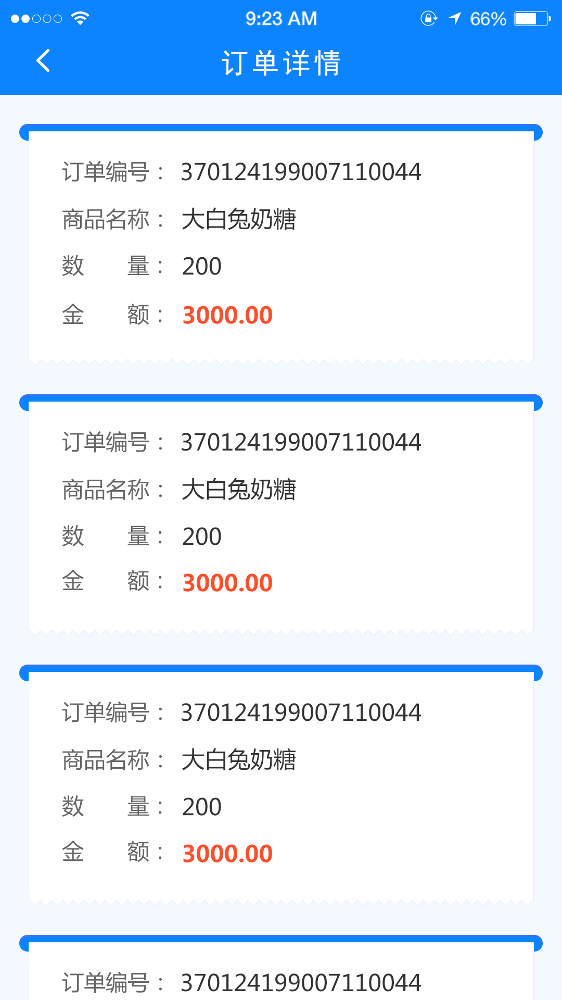

# MarkdownGrammar

Markdown 语法
==============

1. 井号 `#` 代表标题级数
# 一级标题
## 二级标题
一次往下即 `1` 到 `6` 个 `#`,对应标题 `1` 到 `6`阶。

2. 分割线的语法只需要另起一行，连续输入三个星号***或___即可
_____________

--------------

***

3. 使标题加粗
=================

4. 显示链接中带括号的图片
![][1]
[1]: http://latex.codecogs.com/gif.latex?\prod%20\(n_{i}\)+1

5. 输入的URL或邮箱自动创建链接，用<>。
<http://baidu.com>

<2281075105@qq.com>

6. 小型文本
<small>Markdown 语法</small>

7. 缩进
&emsp;&emsp;全角空格

8. 删除线 
~~Markdown 语法~~

9. Markdown 语法 [[^1]]()

   Markdown 语法 [[20]]()

10. [MarkdownGrammar](https://github.com/lb2281075105/MarkdownGrammar.git)

11. *字体斜体*
    **字体加粗**
    ***字体加粗并变斜***

12. 图片添加链接

13. 跳转到标题对应的内容
   [[^1]]() [Markdown 语法](#Markdown)里面不能有空格
             
            # Markdown

   [[^2]]() [Markdown 语法](#Markdown)里面不能有空格
            #Markdown

14. 

    MJRefresh Markdown语法错误

15. 关于 Markdown ([Markdown 语法], [Markdown 语法], [Markdown 语法])

16. `*` 、`+`、 `-` 无序
    + Markdown 语法
      + Markdown 语法
        - Markdown 语法
          * Markdown 语法
    1. 有序
    2. 有序
    
    1. 首先fork我的项目
    2. 把fork过去的项目也就是你的项目clone到你的本地
    3. 在命令行运行 `git branch develop` 来创建一个新分支
    4. 运行 `git checkout develop` 来切换到新分支
    5. 运行 `git remote add upstream https://github.com/numbbbbb/the-swift-programming-language-in-chinese.git` 把我的库添加为远端库
    6. 运行 `git remote update`更新
    7. 运行 `git fetch upstream gh-pages` 拉取我的库的更新到本地
    8. 运行 `git rebase upstream/gh-pages` 将我的更新合并到你的分支

    这是一个初始化流程，只需要做一遍就行，之后请一直在develop分支进行修改。

    如果修改过程中我的库有了更新，请重复6、7、8步。

    修改之后，首先push到你的库，然后登录GitHub，在你的库的首页可以看到一个 `pull 

    request` 按钮，点击它，填写一些说明信息，然后提交即可。

17. [Markdown 语法]:https://github.com/lb2281075105/MarkdownGrammar.git

18. 对号：
    - [x] Markdown 语法
    另一种样式：
    - [ ] Markdown 语法

19. 表格：

序号        |       类库     |     简介     |
:--------- |:-------------:|:-------------|
1          | 济南仓         |     大明湖    | 
2          | 菏泽仓         |     牡丹花    |

序号        |       中学生   |     成绩     |
:---------:|:-------------:|:-----------:|
1          | 李四           |     98分    | 
2          | 张三           |     100分   |

序号        |       小学生   |     简介     |
----------:|:-------------:|------------:|
1          | 小明           |     89分    | 
2          | 小亮           |     100分   |

20. 脚注

    使用[^n]占位符号可以将脚注[^1]添加到文本[^2]中。

21. 换行符 : 一行结束时输入两个空格
   
22. 使用[1]标记

    [1]: 第一个上标解释 ↩

